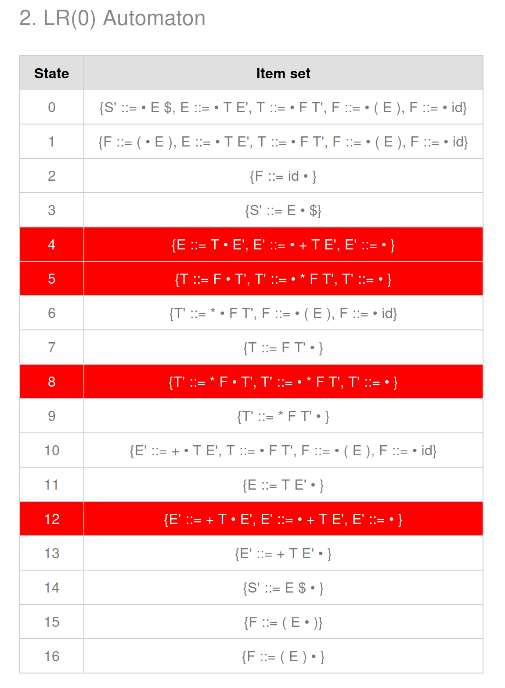

# CSC4180 Assignment 3
## Name: Fang Zihao, Student ID: 122090106

# Q1. Resolve Ambiguity for Micro Language Grammar
## 1. 
The counter example is like:
```
a + b - c
```  
According to the Context-Free Grammar, this will apply to the Rule 8:
```
<expression> -> <primary> {<add op> <primary>}
```
Thus, the expression will be parsed as:
```
<expression> -> ID PLUOP ID MINUSOP ID
```
However, as for how to generate the parse tree and abstract syntax tree, it depends on the parsing direction. If the parser parses from the left to right, it will generate the following abstract syntax tree:
```
           PLUOP
           /   \
          /     \
         ID   MINUSOP
              /     \
             /       \
            ID       ID
```
If the parser parses from the right to left, it will generate the following abstract syntax tree:
```
           MINUSOP
           /     \
          /       \
        PLUOP     ID
        /   \
       /     \
      ID     ID
```
Both are legal. Therefore, the grammar of Micro Language is ambiguous.
## 2.
### (a)
No. It could mean that the grammar needs more look-ahead tokens, or is not suitable for LL parsing technique, but not necessarily mean that the grammar is ambiguous.
### (b) 
Yes. Since there is no multiply defined entry in the LL(1) parsing table of the grammar, the LL(1) parser is valid. By the definition, if a grammar is parsable by LL(1) parser, then it cannot be ambiguous.

# Q2. Simple LL(1) and LR(0) Parsing Exercises
## LL(1) Grammar
### 1.
Both E and T are multiply defined, because both of them have multiple definitions that share the common prefix. For E, it is T. For T, it is int. Therefore, to resolve the multiply defined entries and eliminate ambiguities, we need to use left factoring to factorize the common prefix, and then define a new non-terminal to represent the rest. The result LL(1) Grammar is as follows:
```
E -> T E'
E' -> + T E'
E' -> ε
T -> F T'
T' -> * F T'
T' -> ε
F -> ( E )
F -> int
```
### 2.
The translated LL(1) Grammar is as follows:
```
E ::= T E'
E' ::= + T E'
E' ::= ''
T ::= F T'
T' ::= * F T'
T' ::= ''
F ::= ( E )
F ::= int
```
The two tables are as follows:

*First, Follow, and Nullable Table*


*Parse Table*

## 3. 
The animation will start from the top, that is, E, and then derives to T and E'. Next, T will derive into F and T', and then it will set "int" to F, and "epsilon" to T', etc. It shows the process of the top-down parsing. The generated parse tree is as follows:

*Parse Tree*

## LR(0) Grammar
## 1. 
The generated LR(0) automaton is as follows:

*LR(0) Automaton Table*


*LR(0) DFA Diagram*

## 2.
LL(1) grammar is not LR(0), because LR(0) grammar does not perform any look-ahead, while LL(1) grammar will perform look-ahead for one token. Therefore, there might be conflicts in the LR(0) grammar, as there might be same production rules in different states. For example, in the picture below, state 4 conflicts with 12, and 5 conflicts with 8.


*Use LL(1) in LR(0)*

LR(0) grammar is also not LL(1) as it contains left recursions. For example, "L ::= L ; S" contains left recursion for non-terminal L.

## 3.
Bottom-up parsers are non-intuitive and not easy to understand. As top-down parsers start from the whole program and recursively parse down to the leaves, and then return to the complete parse tree, bottom-up parsers tend to start from the terminals and build the non-terminals by shift and reduce. Therefore, Bottom-up parsers needs a DFA which is difficult to be built by hand based on the context free grammar. These are easier for computers to understand and convert, but not for humans.

# Q3. Implement LL(1) Parser by hand for Oat v.1 
## Usage
To run the hand-written LL(1) Parser, simply follow the usage of the program:
```
Usage: python3 parser.py <grammar file> <input file> <output png file>
```
Where:
- "grammar file" is the path to the grammar file. In this case, it is "Oat-v1-LL1-grammar.txt." Of course, it can be any valid LL(1) grammar, as long as you also modify the Scanner class.
- "input file" is the path to the input source code.
- "output png file" is the path to the output parse tree in PNG format. 


## Explanations
1. The original production rules cannot be used directly for LL(1) parsing, as it contains left recursions and backtracking, which should not appear in valid LL(1) grammar. For example, one of the production rules is `exp ::= exp bop exp`, which contains  left recursion (exp as the left-most non-terminal). To make it an LL(1) grammar, we need to decomposite it into `term exp'`, where term can be primary or primary applied with unary operators, and exp' should be "bop term exp'" that keeps the original function while eliminating left recursion.
2. For the grammar reader, it will firstly read line by line, and split the left hand side and right hand side with "::=". Next, it will further split the right hand side by space characters and return a list, or return an empty list if the right hand side is epsilon. Next, append this production rule to the production rule dictionary. For easier processing latter, it will iterate through all the symbols and find if it is not in the key set of production rules. If it is not, then add it to the terminal set.
3. The compute_nullable function identifies non-terminals that can derive the epsilon. It iterates over all productions, marking a non-terminal as nullable if all symbols in a production are nullable. This process repeats until no new nullable non-terminals are found.  The compute_first function calculates the first sets for all non-terminals. It iteratively changes the first sets by examining each production rule. For each non-terminal, it processes every symbol in its productions: if the symbol is a terminal, it is added to the first set, and the loop breaks. If the symbol is a non-terminal, its current FIRST set is merged into the non-terminal’s FIRST set. If the symbol is not nullable, the loop breaks; otherwise, processing continues to subsequent symbols.
3. The compute_follow function determines follow sets for non-terminals by propagating context from parent symbols in productions. Starting with the start symbol's follow set initialized to `{'$'}`, it processes productions in reverse order. For each symbol in a production, if it is a non-terminal, then the follow set of the parent non-terminal is merged into its follow set. If the symbol is nullable, the first set of subsequent symbols is added to the follow set; otherwise, the first set replaces the trailer. 
4. The compute_table function constructs the LL(1) parsing table by combining first and follow sets. For each production, it computes the first set of the right-hand side. If the rhs is nullable, the follow set of the non-terminal is added to the prediction. Each terminal in the computed set maps the production to the corresponding table entry. This ensures that the table resolves conflicts by relying on first for non-nullable derivations and follow for nullable ones, enabling deterministic parsing decisions.
5. The parse function uses the constructed parse table to drive a stack-based LL(1) parser. It initializes the stack with the start symbol and processes input tokens sequentially. For each stack symbol, if it is a terminal, it matches the current input token. If it is a non-terminal, the parser consults the table to select a production based on the current input token, expanding the non-terminal into its production's symbols. The parse tree is dynamically built by replacing nodes with their derived productions. Errors are raised for unmatched terminals or missing table entries.


# Bonus. Implement a Bottom-Up Parser using Yacc for Oat v.1 Language
## Usage
To run the Yacc-based Parser, simply follow the usage of the program:
```
Usage: python3 yacc.py <input file> <output png file>
```
Where:
- "input file" is the path to the input source code.
- "output png file" is the path to the output parse tree in PNG format.

## Explanations
This implementation utilizes Yacc in PLY (Python-Lex-Yacc) and the lexer implemented in Assignment 2. Here, I manually translated the LL(1) context free grammar into the form that Yacc understands. Therefore, the built-in parser builder will build the parse tree according to the given grammar automatically.